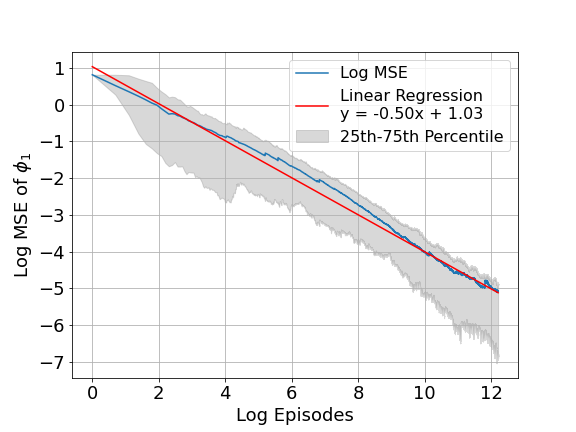

# Sublinear Regret for a Class of Continuous-Time Linear-Quadratic Reinforcement Learning Problems

This repository is the official implementation of [Sublinear Regret for a Class of Continuous-Time Linear-Quadratic Reinforcement Learning Problems]. 

## Requirements

To install requirements:

```setup
pip install -r requirements.txt
```

## Running the Simulations

To run the simulations for the model-free and model-based reinforcement learning algorithms, execute the corresponding Jupyter notebooks:

- **Model-Free Simulations:** `Run_Model_Free_Algo.ipynb`
- **Model-Based Benchmark Simulations:** `Run_Model_Based_Algo.ipynb`

## Visualizing the Results

To visualize the results of the simulations and evaluate the performance, use the following notebooks:

- **Visualize Results (Model-Free):** `Visualize_Model_Free_Results.ipynb`
- **Visualize Results (Model-Based Benchmark):** `Visualize_Model_Based_Results.ipynb`

## Results

Both of our experiments are fully reproducible by setting the random seed from 1 to 120. The table below summarizes the performance of both the model-free and model-based algorithms in terms of convergence rate, regret bounds, and approximate sequential running time.

| Algorithm Type                | Convergence Rate | Regret Bound | Running Time  |
| ----------------------------- | ---------------- | ------------ | ------------- |
| Model-Free Actor-Critic       | -0.50            | 0.73         | ~26 hours     |
| Model-Based Plugin Benchmark  | -0.20            | 0.80         | ~50 hours     |

### Understanding the Results

Our results measure the convergence rate and the regret bounds of our proposed model-free algorithm, and we compare these with a model-based benchmark.

#### Convergence Rate
The convergence rate expressed as a negative exponent (e.g., -0.5) indicates that the parameter converges at a rate proportional to $N^{-	\text{exponent}}$. For example, a convergence rate of -0.5 means the convergence of the policy parameter $\phi_{1,n}$ is proportional to $N^{-0.5}$. This represents faster convergence as the number of iterations increases.

#### Regret Bound
The regret bound also uses an exponent to describe how the cumulative regret grows with the number of iterations. A lower absolute value of the exponent signifies a more efficient algorithm, indicating slower growth of regret.

### Figures Explained

Below are the figures demonstrating the performance of our model-free algorithm and its comparison to a model-based approach:

1. **Log MSE for Model-Free Algorithm on $\phi_{1,n}$**:
   
   
   This graph illustrates the declining MSE, showing that the estimation of $\phi_{1,n}$ becomes more accurate with increasing iterations for our model-free algorithm.

2. **Log MSE for Model-Based Benchmark on $\phi_{1,n}$**:
   

   This graph depicts the mean squared error (MSE) in logarithmic scale for the parameter estimation in the model-based approach.

3. **Log Expected Regret for Model-Free Algorithm**:
   

   This graph shows the logarithm of the expected regret over logarithmic scale iterations. The linear regression fit helps visualize the growth rate of regret.

4. **Log Expected Regret for Model-Based Benchmark**:
   

   This graph displays the logarithm of the expected regret for the comparative model-based approach over log-scaled iterations.

## Contributing

Contributions to this project are welcome. Please open an issue to discuss proposed changes or open a pull request with improvements.
